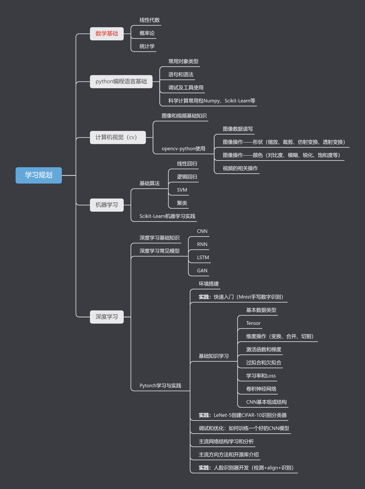

# 深度学习

## 学习规划：

## 学习资料：

python&Numpy基础：[菜鸟教程](https://www.runoob.com/)

机器学习基础： [吴恩达：机器学习](https://open.163.com/newview/movie/free?pid=IEU2H8NIJ&mid=VEU2H8NKA)

深度学习基础：[cs231n计算机视觉课程](https://www.bilibili.com/video/BV1nJ411z7fe?from=search&seid=5835071127684448106&spm_id_from=333.337.0.0)

